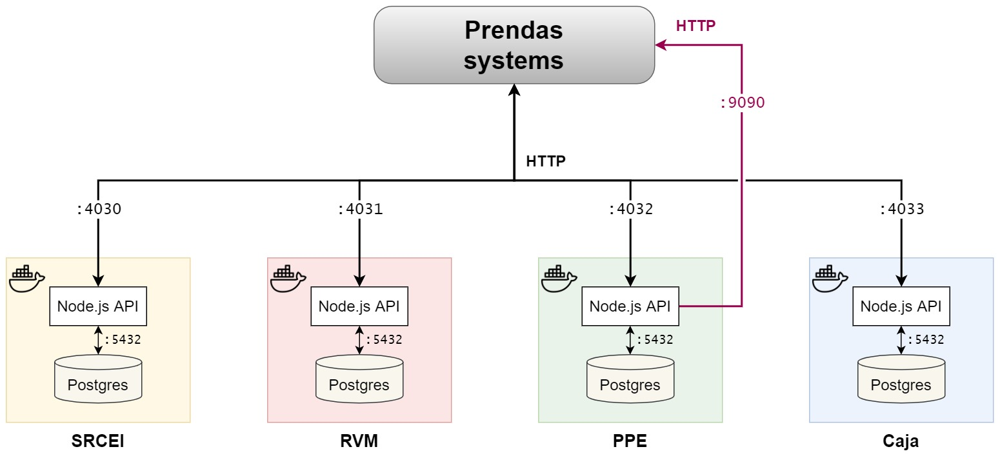
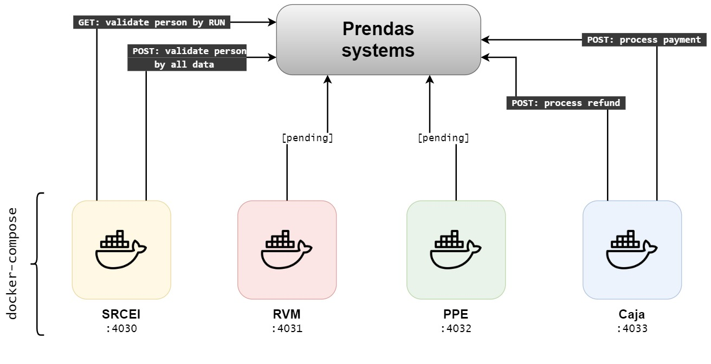

# IIS_servicios_base

> Introducción a la Ingeniería en Software, Universidad de los Andes, 2021

This project will use all systems as git submodules, for running them all easily with [`docker-compose`](https://docs.docker.com/compose/), a tool for managing multi-container Docker applications. This is much better than setting an rough command to run them one by one, and allows to restart them (or not) on crash, enhanced logging management, etc.

**Note: the project is intended to run in a Linux shell**. If you pretend to run or test the environment locally in Windows, you may install [Ubuntu](https://www.microsoft.com/en-us/p/ubuntu-2004-lts/9n6svws3rx71) via [WSL](https://docs.microsoft.com/en-us/windows/wsl/install) and run it easily, after installing the [dependencies](#dependencies).

- [IIS_servicios_base](#iis_servicios_base)
  - [1. Code browsing and contributing](#1-code-browsing-and-contributing)
  - [2. Dependencies](#2-dependencies)
    - [2.1. Windows machines with WSL](#21-windows-machines-with-wsl)
    - [2.2. Windows machines without WSL](#22-windows-machines-without-wsl)
    - [2.3. Ubuntu-based machines](#23-ubuntu-based-machines)
  - [3. Overall project software architecture](#3-overall-project-software-architecture)
  - [4. API documentation](#4-api-documentation)
  - [5. Build and run](#5-build-and-run)
  - [6. Logging](#6-logging)
  - [7. Testing](#7-testing)
  - [8. Manually accessing database for each system for debugging](#8-manually-accessing-database-for-each-system-for-debugging)

## 1. Code browsing and contributing

It is recommended to use Visual Studio Code with the following extensions:

- [Better Comments](https://marketplace.visualstudio.com/items?itemName=aaron-bond.better-comments): as various comments are formatted to be rendered nicely by this tool.
- [Docker](https://marketplace.visualstudio.com/items?itemName=ms-azuretools.vscode-docker): for `Dockerfile` and `docker-compose` intellisense.
- [Markdown All in One](https://marketplace.visualstudio.com/items?itemName=yzhang.markdown-all-in-one): for various smart Markdown utilities, such as section headers, automatic table of contents, etc.
- [Markdownlint](https://marketplace.visualstudio.com/items?itemName=DavidAnson.vscode-markdownlint): linter for implementing the standardized best practices for writing Markdown files.

## 2. Dependencies

- [Docker](https://docs.docker.com/get-docker/) and [`docker-compose`](https://docs.docker.com/compose/install/).
- (Optional) Just for the `config` Makefile rule, the [`yq` command-line YAML processor](https://github.com/mikefarah/yq) is required. You can install it on Ubuntu-based OSes with `wget https://github.com/mikefarah/yq/releases/download/v4.13.2/yq_linux_amd64.tar.gz -O - | tar xz && sudo mv yq_linux_amd64 /usr/bin/yq`.

### 2.1. Windows machines with WSL

If you pretend to run this on Windows, the best way is to do it on a WSL Linux console instead of a Windows terminal. First, install [WSL 2](https://docs.microsoft.com/en-us/windows/wsl/install) (very easy for the latest Windows 10 versions) and install Docker Desktop. You may choose [Ubuntu](https://www.microsoft.com/en-us/p/ubuntu-2004-lts/9n6svws3rx71) for WSL, then follow [this guide](https://nickjanetakis.com/blog/setting-up-docker-for-windows-and-wsl-to-work-flawlessly). Don't forget to [enable integration with WSL](./docs/Docker_Ubuntu_WSL_config.png) on Docker Desktop.

### 2.2. Windows machines without WSL

Install Docker Desktop normally and then install [MinGW](https://sourceforge.net/projects/mingw/) for running the `Makefile` with `mingw32-make` command instead of the usual `make`, in the Windows command prompt. Don't forget to add `C:/MinGW/bin` to your PATH after installing. This option is not recommended, as installing MinGW can be tricky.

### 2.3. Ubuntu-based machines

Just follow the [official Docker guide](https://docs.docker.com/engine/install/ubuntu/) for installing Docker (easier than Windows). You might need to run `sudo apt-get update && sudo apt-get install make` for getting the `make` GNU utility.

## 3. Overall project software architecture

The exposed API ports for the systems can be configured at [`compose.env`](./compose.env). The below figures show the overall systems architecture. Each system is executed as a Docker container, with only a single exposed port (the API port). In the API calls figure, the arrows point towards the system they are providing the specified endpoint or call (in other words, the colored one is an endpoint exposed by Prendas, see the [PPE API documentation](./docs/api/PPE.md)).

## 4. API documentation

The usage docs for the APIs are located at `docs/api` in this project. All of them contain sample `curl` commands (which is a console tool for making HTTP requests, working on Linux as well as Windows OSes, if desired).

## 5. Build and run

The Makefile rules are stated in the below table. You may only have interest in the `up` one.

**If you have problems with `make pull`:** please pull manually and run `git submodule update --init --recursive`.

| Makefile rule     | Description                                                                                                                                  |
| ----------------- | -------------------------------------------------------------------------------------------------------------------------------------------- |
| `build` (default) | Builds the Docker images for all systems.                                                                                                    |
| **`up`**          | **Launches the systems as Docker containers (builds and pulls if needed) and outputs to stdout/stderr**. Use ctrl+c to stop the environment. |
| `up_background`   | Executes `up`, but in background.                                                                                                            |
| `pull`            | Updates all systems (pulls/initializes submodule repos). Make sure you don't have uncommitted changes before running this rule.              |
| `down`            | Shuts down all systems. You may need it when running `up_background`.                                                                        |
| `config`          | Ensures the `docker-compose.yaml` configuration file is correct, and prints it prettified with `yq`.                                         |
| `test`            | Executes test API calls. See the [testing section](#testing) below.                                                                          |

## 6. Logging

If you run the systems with `make up`, you will see the output in stdout/stderr. For `make up_background`, you can use `docker-compose --env-file compose.env logs` to view all logs (while located in the base project directory) or use `docker logs [srcei|caja|rvm|ppe]_cointainer` to view the log of one of the systems (e.g. `docker logs srcei_container`). You can view the live log (follow) by using the `-f` flag. Note that `docker logs` will work in any directory, but `docker-compose logs` not, as you have to pass the `compose.env` file path.

## 7. Testing

For running automated test API calls, first ensure the systems are running locally in your machine and then run `make test TGR_TARGET_HOST=${MY_LAN_IP}`, where `MY_LAN_IP` is the environment variable representing the LAN-level IP address of your machine (run `python3 tests/curl_tests.py help` for a more technical description). Of course, you must have Python 3 installed for running the tests.

In order to find your LAN IP, in a bash shell, run `hostname -I` or `ifconfig`, in the case of Linux. For Windows, run `ipconfig` in a terminal.

## 8. Manually accessing database for each system for debugging

It is possible to access the Postgres client to make database query directly into the databases for each system, inside their corresponding container. For this:

1. Ensure the Docker containers are running. You can view the currently running containers with `docker ps`.
2. Execute `docker exec -it [srcei|caja|rvm|ppe]_cointainer /bin/psql`, according to the system you want to connect to. This will run the console Postgres client for the user `root` and database `root`, where the tables are located for all systems.
