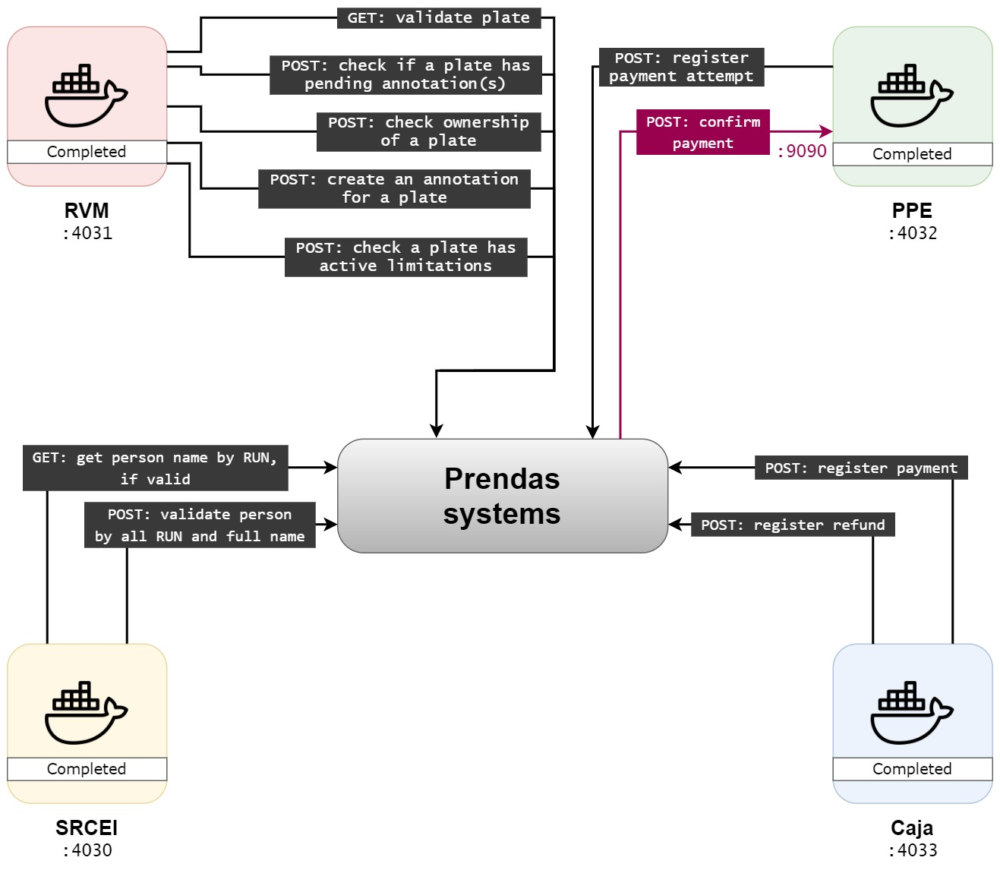

# IIS_servicios_base

> Introducción a la Ingeniería en Software, Universidad de los Andes, 2021

This project will use all systems as git submodules, for running them all easily with [`docker-compose`](https://docs.docker.com/compose/), a tool for managing multi-container Docker applications. This is much better than setting an rough command to run them one by one, and allows to restart them (or not) on crash, enhanced logging management, etc.

## Dependencies

Note: this project is intended to run in an Ubuntu-based host OS.

- `docker-compose` command (and Docker service). In Windows, it all comes with Docker Desktop. For other OSes, follow the [official installation guide](https://docs.docker.com/compose/install/).
- Just for the `config` Makefile rule, the [`yq` command-line YAML processor](https://github.com/mikefarah/yq) is required. You can install it on Ubuntu with `wget https://github.com/mikefarah/yq/releases/download/v4.13.2/yq_linux_amd64.tar.gz -O - | tar xz && sudo mv yq_linux_amd64 /usr/bin/yq`.

## Overall project software architecture

The exposed API ports for the systems can be configured at [`compose.env`](./compose.env). The below figures show the overall systems architecture. Each system is executed as a Docker container, with only a single exposed port (the API port).

## API documentation

The usage docs for the APIs are located at `./docs/api` in this project. All of them contain sample `curl` commands (which is a console tool for making HTTP requests, working on Linux as well as Windows OSes).

## Build and run

The Makefile rules are stated in the below table. You may only have interest in the `up` one.

| Makefile rule     | Description                                                                                                                                                                     |
| ----------------- | ------------------------------------------------------------------------------------------------------------------------------------------------------------------------------- |
| `build` (default) | Builds the Docker images for all systems.                                                                                                                                       |
| **`up`**          | **Launches the systems as Docker containers (builds, pulls and executes tests if needed) and outputs to stdout/stderr**. The systems are launched only if the tests are passed. |
| `pull`            | Updates all systems (pulls/initializes submodule repos). Make sure you don't have uncommitted changes before running this rule.                                                 |
| `down`            | Shuts down all systems.                                                                                                                                                         |
| `config`          | Ensures the `docker-compose.yaml` configuration file is correct, and prints it prettified with `yq`.                                                                            |
| `test`            | Executes test API calls. See section below.                                                                                                                                     |

## Testing

For running automated test API calls, first ensure you are running the systems locally and then run `make test`. You must do this in a Linux shell and must have Python installed.
