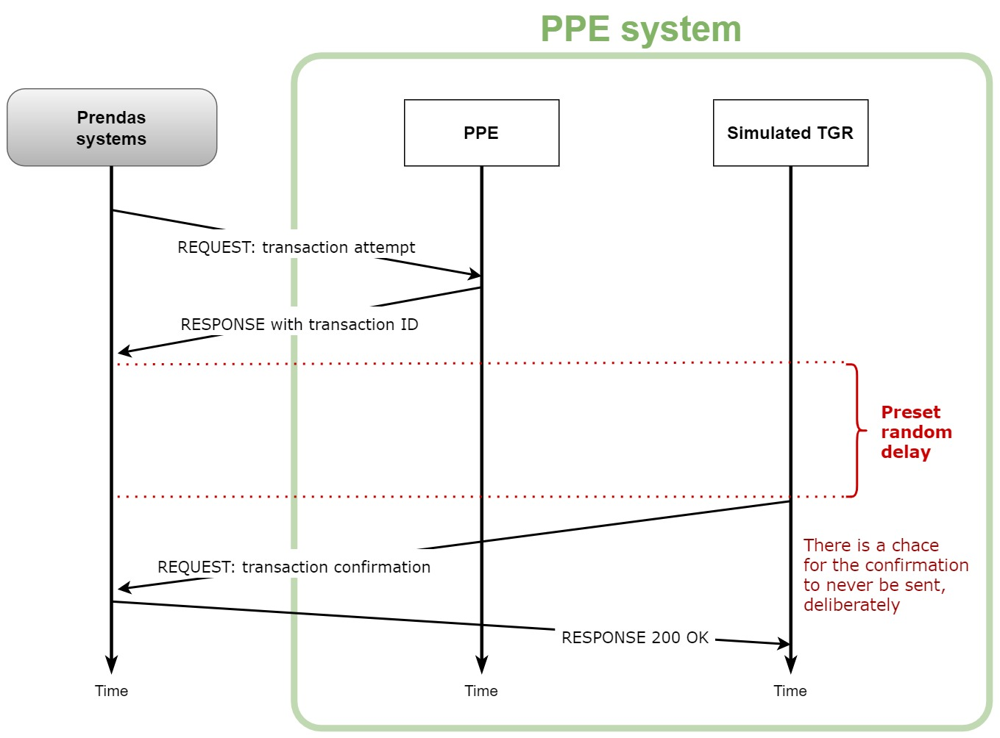

# PPE API

This API serves the purpose of validating data requests for the PPE system (*portal de pago electrónico*). Note that this system is supposed to interact asynchronously with TGR (*tesorería general de la república*) for payment confirmation, which will be simulated (see the section below).

- [PPE API](#ppe-api)
  - [1. Confirmation from TGR](#1-confirmation-from-tgr)
    - [1.1. Desired example calls format](#11-desired-example-calls-format)
  - [2. POST: register payment attempt (PPE)](#2-post-register-payment-attempt-ppe)
    - [2.1. Request body format](#21-request-body-format)
    - [2.2. Example calls](#22-example-calls)

## 1. Confirmation from TGR

When receiving a valid payment call from the PPE API consumer (Prendas), the transaction is registered and marked as pending (from TGR confirmation), and the ID for that transaction is returned to Prendas in the response immediately. Then, a random amount of time is set for the simulated TGR to send the confirmation to Prendas (passing the transaction ID previously returned to Prendas by PPE), by consuming an API exposed by Prendas after that random time. See the image below. There's also a probability for TGR to never send the confirmation, which has to be considered (Prendas will have to set a timeout for TGR confirmation for a PPE transaction).



So this confirmation endpoint is consumed by ourselves and has to be exposed by the Prendas systems. Once we have it, this works as a callback from the payment attempt API endpoint. The documentation for this endpoint has to be provided from Prendas, but we state the desired shape format as follows:

### 1.1. Desired example calls format

Let `PRENDAS_IP` be one host the Prendas servers.

Request for validating/confirming the payment of the transaction with ID, say, `4`, previously given to Prendas when they consumed the [register payment attempt endpoint](#2-post-register-payment-attempt-ppe) from PPE.

```shell
curl --location --request POST "http://${PRENDAS_SERVER_IP}:9090/api/tgr_confirmation" \
    --header 'Content-Type: application/json' \
    --data-raw '{
        "transaction_id": 4
    }'
```

Both the port and the path **must** match the example call, `9090` and `/api/tgr_confirmation`, respectively.

When this call is executed, the response status is expected to be 200 OK, with **no body**. Having a body like `{"msg": "OK"}` would be redundant, as the payment confirmation was already acknowledged with the successful response. If the response is not received or the request cannot be delivered, the simulated TGR will retry again after a timeout, until the confirm payment request succeeds or the amount of allowed retries is reached, which is also a configuration parameter in our systems (so the confirmation process won't fail if the Prendas systems crash or are offline for some minutes).

Note: for testing/debugging purposes, you may have interest on the [echo server Python script](./../../tests/echo_server.py), which prints out the received HTTP requests. Considering the passed IP for the [PPE payment attempt endpoint](#2-post-register-payment-attempt-ppe) is OK, you can set it to listen to TGR confirmation calls with:

```shell
python3 tests/echo_server.py -b 0.0.0.0 -p 9090 --verbose
```

<!-- ppePaymentRequest -->

## 2. POST: register payment attempt (PPE)

`api/transaction/payment`: endpoint that immediately register the payment in PPE and returns the transaction ID, and starts the simulated TGR response flow. It requires the person id, repertoire number and the amount of money, as well as the target IP for the payment confirmation TGR call. The response body will include the transaction ID for further asynchronous confirmation with TGR.

### 2.1. Request body format

```json
{
    "id_persona": "[string] Person ID",
    "numero_repertorio": "[string] RVM repertoire ID in format YEAR-NUMBER",
    "monto": "[float | integer] Transaction amount",
    "confirmation_ip": "[string] Target host for the confirmation call"
}
```

### 2.2. Example calls

Request:

```shell
curl --location --request POST "${SERVER_IP}:4032/api/transaction/payment" \
    --header 'Content-Type: application/json' \
    --data-raw '{
        "id_persona": "1092093-5",
        "numero_repertorio": "2018-429",
        "monto": 213540,
        "confirmation_ip": "172.22.206.199"
    }'
```

Response 200 OK:

```json
{
    "msg": "Pago Ingresado",
    "transaction_id" : 2
}
```

Note that, in this example, we give a LAN IP. In production, Prendas must use their server's LAN IPs. If you provide an invalid or unreachable IP, the confirmation won't be able to arrive.
