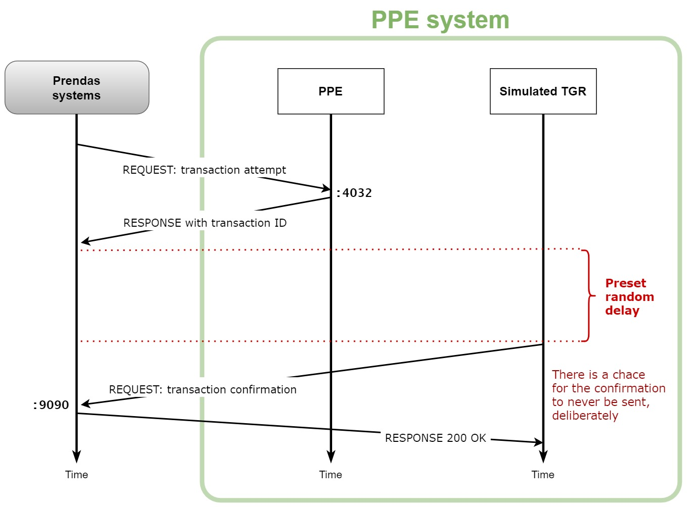

# PPE API

This API serves the purpose of validating data requests for the PPE system (*portal de pago electrónico*). Note that this system is supposed to interact asynchronously with TGR (*tesorería general de la república*) for payment confirmation, which will be simulated (see the section below).

- [PPE API](#ppe-api)
  - [1. Confirmation from TGR](#1-confirmation-from-tgr)
    - [1.1. Desired example calls format](#11-desired-example-calls-format)
  - [2. POST: register payment attempt (PPE)](#2-post-register-payment-attempt-ppe)
    - [2.1. Request body format](#21-request-body-format)
    - [2.2. Example calls](#22-example-calls)

## 1. Confirmation from TGR

When receiving a valid payment call from the PPE API consumer (Prendas), the transaction is registered and marked as pending (from TGR confirmation), and the ID for that transaction is returned to Prendas in the response immediately. Then, a random amount of time is set for the simulated TGR to send the confirmation to Prendas (passing the transaction ID previously returned to Prendas by PPE), by consuming an API exposed by Prendas after that random time. See the image below. There's also a probability for TGR to never send the confirmation, which has to be considered (Prendas will have to set a timeout for TGR confirmation for a PPE transaction).



So this confirmation endpoint is consumed by ourselves and has to be exposed by the Prendas systems. Once we have it, this works as a callback from the payment attempt API endpoint. The documentation for this endpoint has to be provided from Prendas, but we state the desired shape format as follows:

### 1.1. Desired example calls format

Let `PRENDAS_IP` and `PRENDAS_PORT` the host and port of the Prendas server, respectively.

Request for validating/confirming the payment of the transaction with ID, say, `4`, previously given to Prendas when they consumed the [register payment attempt endpoint](#2-post-register-payment-attempt-ppe) from PPE.

```shell
curl --location --request POST "${PRENDAS_SERVER_IP}:${PRENDAS_PORT}/api/tgr_confirmation" \
    --header 'Content-Type: application/json' \
    --data-raw '{
        "transaction_id": 4
    }'
```

Then, the response 200 OK with acknowledgment of the request, with no body. Having a body like `{"msg": "OK"}` would be redundant. If the response is not received or the request cannot be delivered, the simulated TGR will retry again after a timeout, until the confirm payment request succeeds (so the confirmation process won't fail if the Prendas systems crash or are offline for a moment).

<!-- ppePaymentRequest -->

## 2. POST: register payment attempt (PPE)

`api/transaction/payment`: endpoint that immediately register the payment in PPE and returns the transaction ID, and starts the simulated TGR response flow. It requieres the person id, repertoire number and the amount of money. Response gives message and transaction id.

### 2.1. Request body format

```json
{
    "id_persona": "Person ID",
    "numero_repertorio": "N°Repertoire",
    "monto": "Amount"
}
```

### 2.2. Example calls

Request:

```shell
curl --location --request POST "${SERVER_IP}:4032/api/transaction/payment" \
    --header 'Content-Type: application/json' \
    --data-raw '{
        "id_persona": "1092093-5",
        "numero_repertorio": "123",
        "monto": 213540
    }'
```

Response 200 OK:

```json
{
    "msg": "Pago Ingresado",
    "t_id" : 2
}
```

Note: if a body parameter is missing, an exception will be triggered in the server.
